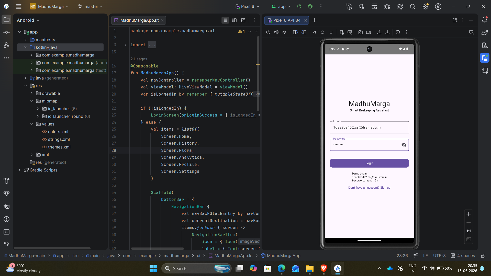
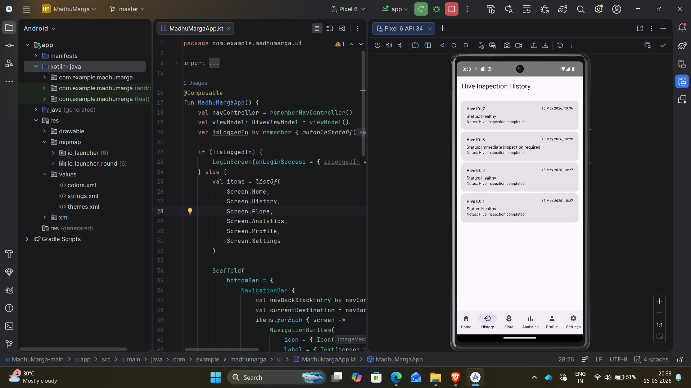
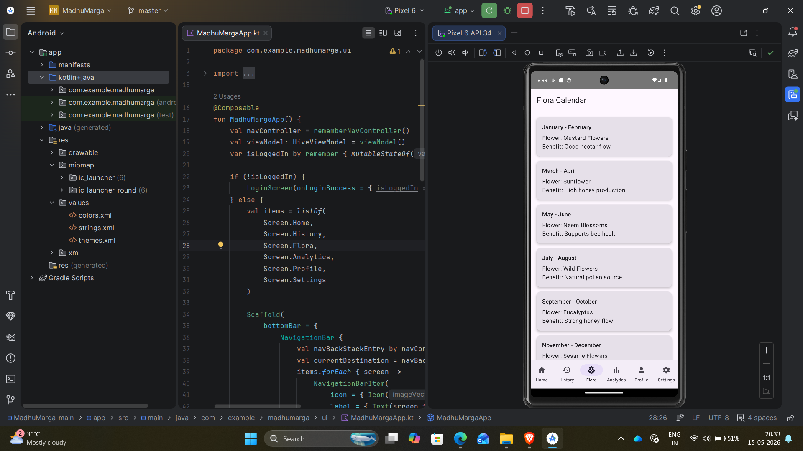
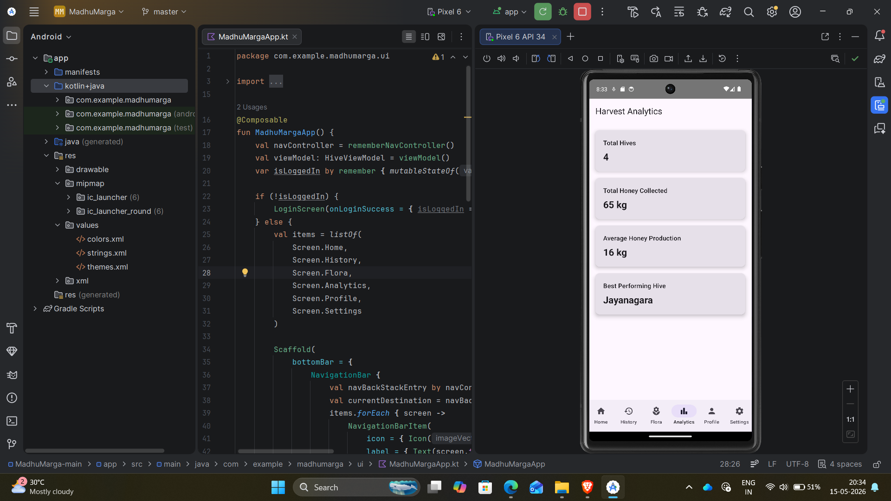
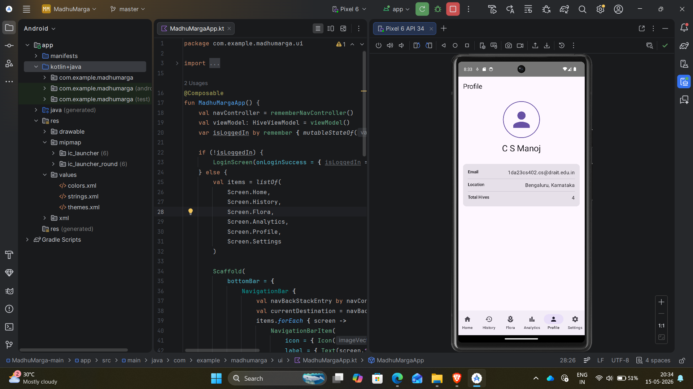
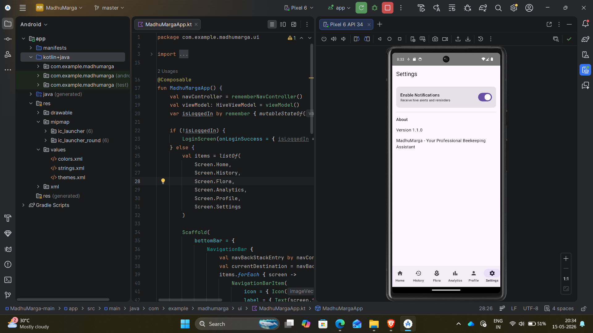

# MadhuMarga 🐝

## Smart Beekeeping Assistant Android App

MadhuMarga is an Android application built using Kotlin and Jetpack Compose to help beekeepers efficiently manage hives, monitor honey production, track hive health, and analyze hive performance.

---

## 📱 Features

### 🔐 Login Screen

- Demo login system for project demonstration
- Clean Material 3 UI design

### 🏠 Home Dashboard

- View hive information
- Honey collection tracking
- Queen bee presence monitoring
- Pest detection status
- Honey flow progress tracking
- Delete hive functionality

### ➕ Add Hive

- Add new hive details dynamically
- Store hive data using Room Database

### 📜 Hive Inspection History

- Track hive inspection records
- View inspection status and timestamps

### 🌼 Flora Calendar

- Seasonal flower guidance for improved honey production
- Helps understand nectar flow periods

### 📊 Analytics Dashboard

- Total hive count
- Total honey collected
- Average honey production
- Best performing hive analysis

### 👤 Profile Screen

- User profile information
- Dynamic hive statistics

### ⚙️ Settings Screen

- Notification toggle for hive alerts and reminders
- App information section

---

## 🛠️ Technologies Used

- Kotlin
- Jetpack Compose
- Room Database
- Material 3
- MVVM Architecture
- Android Studio

---

## 📂 Project Structure

```text
com.example.madhumarga

data/        → Database and model classes
ui/          → Jetpack Compose UI screens
viewmodel/   → Business logic and state management
```

---

## ⚙️ Setup Instructions
### Repository Link

https://github.com/1da23cs402cs-cyber/MadhuMarga

### Clone Repository

```bash
git clone https://github.com/1da23cs402cs-cyber/MadhuMarga.git
```

### Open in Android Studio

1. Open Android Studio
2. Click on Open Project
3. Select the MadhuMarga folder
4. Wait for Gradle sync
5. Run the application on Emulator or Android device

---

## 📷 Application Screenshots

### 🔐 Login Screen


---

### 🏠 Home Dashboard


---

### 🏠 Additional Dashboard View


---

### 📜 Hive History


---

### 🌼 Flora Calendar


---

### 📊 Analytics Dashboard


---

### 👤 Profile Screen


---

### ⚙️ Settings Screen


---

## 🚀 Future Improvements

- Firebase Authentication
- Cloud Data Synchronization
- Push Notifications
- AI-based Hive Health Prediction
- Weather API Integration
- Image-based Pest Detection

---

## 👨‍💻 Developer

**C S Manoj**  
Android Development Intern  
Dr. Ambedkar Institute of Technology

---

## 📌 Project Purpose

This project was developed as part of an Android Development Internship to demonstrate modern Android application development using Kotlin, Jetpack Compose, MVVM architecture, and Room Database.

---

## ⭐ Support

If you found this project useful, consider giving it a star ⭐ on GitHub.
